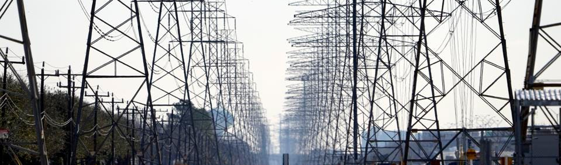

# Texas-Power-forecasting-timeseries

## Business understanding and problem
In 2021, there was a severe winter storm that pushed the Texas power grid to the point of failure. The balancing authority, Electric Reliability Council of Texas (ERCOT), covers the majority of the state and is disconnected from other US balancing authorities. Since grid failures like this proved to be catastrophic, our analysis aims to better prepare the region through predictive timeseries modeling. We used the interchange value, which is the net power generation minus the demand, and created a SARIMAX forecasting model to predict changes in the state of the grid. We used weather data as exogenous variables from four regions across Texas, and the most statistically significant variables to predict interchange value. We then evaluated our model based on how accurately it predicted points where the interchange value switched sign between positive and negative, signaling an important difference between demand and energy generated.  

## Data 

Our data was [sourced](https://eia.gov/electricity/gridmonitor/dashboard/electric_overview/US48/US48) from the US Energy Information Administration (EIA). They provide bi-yearly reports of power generation and use, as well as the source of the energy such as coal or wind.

For Texas weather data, we found a source dataset spanning the same time period as our analysis (2018 through 2022). This dataset came from [NOAA](https://www.ncei.noaa.gov/cdo-web/), via the National Centers for Environmental Information portal.

## Data preparation

To prepare our data, created a datetime based index, and imputed the few missing time periods. Datasets were concatenated to one Pandas dataframe. Then we evaluated the time series data by plotting it, then analyzing it for stationarity. We then downsampled from hourly to both daily and weekly to reduce computational time. Finally, the data was split into a training and test set, using the first 80% for training and the final 20% for testing.

## Modeling

To find the best model, we ran multiple grid searches that found the optimal hyperparameter combinations. The parameters were chosen based on the root mean squared error (RMSE) metric.

## Evaluation

Our model successfully matched the ground truth data in both the training and test sets. The final model outperformed our initial baseline according to RMSE, which was 245 baseline and 220 final. Based on the p-values of all our exogenous features in our best daily model, we found that the maximum temperature, snow level, and precipitation were frequently statistically significant. This demonstrates its importance as an indicator for predicting total interchange values.  We created a custom function  to evaluate the accuracy of our model which produced a score of 0.71 (rounding to two significant digits).

Our model was also able to forecast a projection for the next year:

# Conclusions

Although the data seemed quite noisy, we were able to show that patterns in generation vs. demand are classifiable using prior grid and weather data. This allows for the balancing authority to better anticipate and adapt to fluctuations in the energy needs of their customers.

## Next steps

With more time, we could extend our model to help predict black-swan type events like the 2021 winter storm crisis, to help prevent the grid from going down for long periods of time. The model could be used to create automated adaptive switching to the most robust energy source or other measures to meet a sudden spike in demand. Then, we would like to create a generalized model to be applied to other regions beyond Texas.

## Repository Structure

├── Data                               <- Collection of provided data, including images
├── Notebooks            	       <- Individual team members' working Jupyter notebooks.
├── .gitignore                         <- Rules to ignore by Github.
├── README.md                          <- This file.
└── Final_Notebook.ipynb   	       <- Jupyter Notebook containing exploration and analysis of our data.
